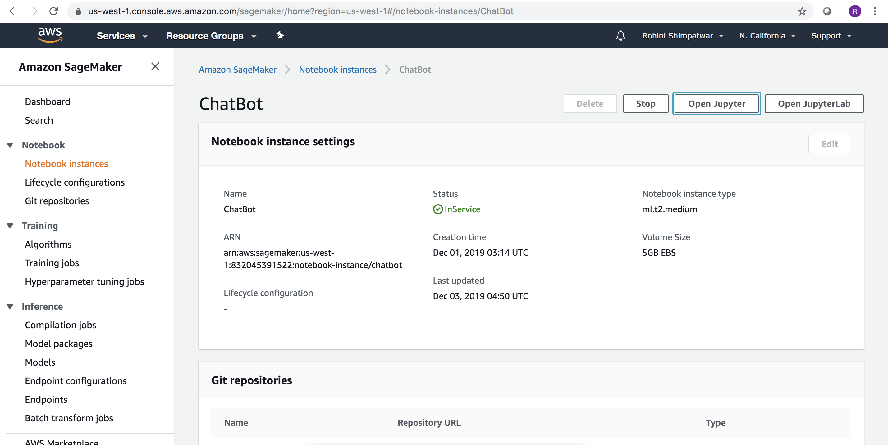

Team Neurons 

- Abhishek Prabhudesai

- Pooja Agarwal

- Rohini Shimpatwar

- Saurabh Aggarwal

Google colab link - https://colab.research.google.com/drive/1wcWdOaBQ1x5zx1gkUt6zl883zzaVpfFN#scrollTo=JtNhNukNI8pI

Steps for AWS Pipeline

1) Created s3 and put Cornell Movie Dataset in the bucket to access it.

2) Created SageMaker instance and uploaded notebook .

3) Ran the jupyter notebook and implemented the model.

