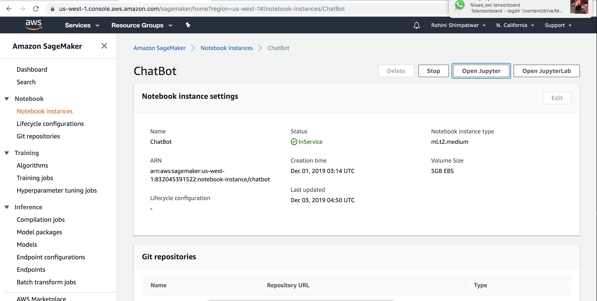
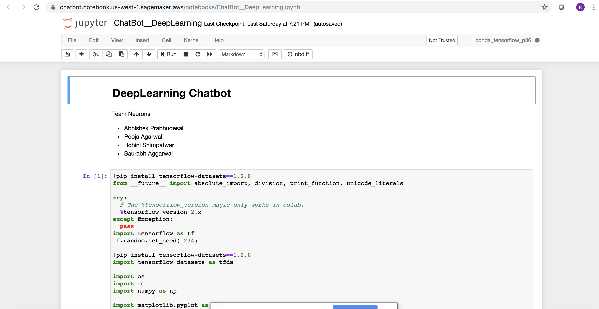

Team Neurons 

- Abhishek Prabhudesai

- Pooja Agarwal

- Rohini Shimpatwar

- Saurabh Aggarwal

We have implemented a Deep learning based chatbot using state-of-the-art Attention  and Encoder-Decoder models based approach. The Cornell movie dataset contains movie titles , dialogs, movie lines, movie conversations etc. which are cleaned and tokenized using tfds SubwordTextEncoder tokenizer. Then they are converted in tf datasets. And passed through attention and encoder decoder layers for neural network learning and prediction.

We have also used AWS S3-Sagemaker-Jupyter pipeline to deploy our model on cloud and having the data stored in S3.

Google colab link - https://colab.research.google.com/drive/1wcWdOaBQ1x5zx1gkUt6zl883zzaVpfFN#scrollTo=JtNhNukNI8pI

Dataset- Cornell Movie Dataset link - https://www.cs.cornell.edu/~cristian/Cornell_Movie-Dialogs_Corpus.html

Steps for AWS Pipeline

1) Created s3 and put Cornell Movie Dataset in the bucket to access it.

2) Created SageMaker instance and uploaded notebook .

3) Ran the jupyter notebook and implemented the model.

4) Tensorboard ScreenShots

